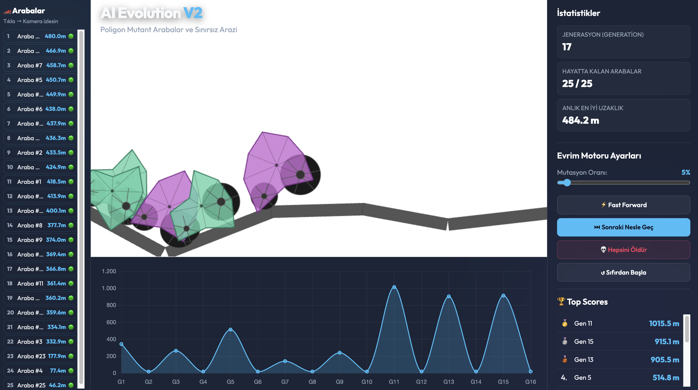
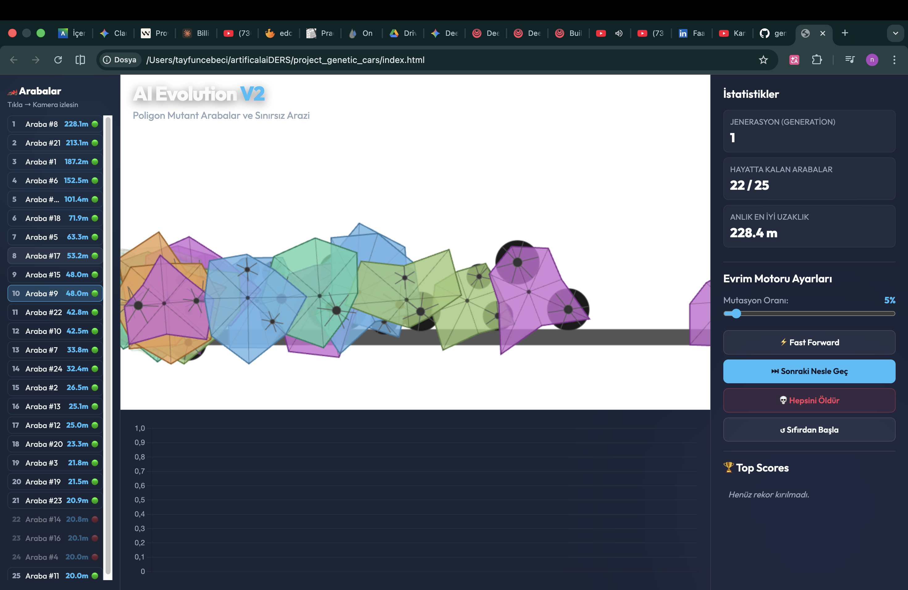
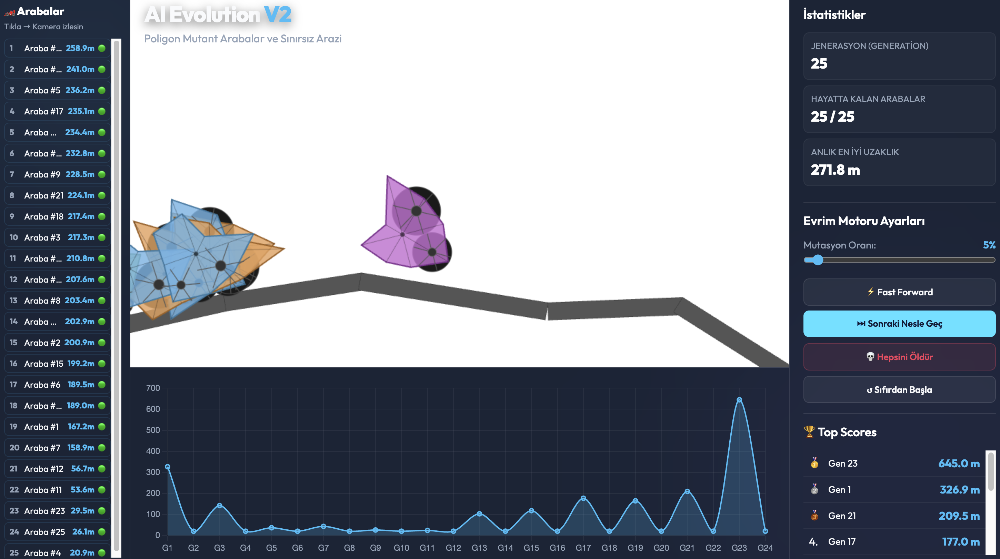

# Genetic Cars Evolution: An Optimization Simulation Using Genetic Algorithms

**Project Demo Video:**

This repository contains a web-based simulation environment that utilizes Genetic Algorithms (GA) to evolve 2D vehicle designs capable of traversing procedurally generated terrain. The project demonstrates the application of natural selection principles—such as crossover, mutation, and elitism—within a rigid-body physics simulation.

## Simulation Preview

## Project Overview

The objective of the simulation is to evolve a population of autonomous vehicles to achieve the maximum horizontal distance over an unpredictable, highly uneven landscape. Each vehicle is defined by a unique genome that determines its physical characteristics, including body shape, wheel dimensions, and motor torque. The simulation integrates these biological concepts with a physics-driven environment to solve a complex optimization problem.

## Core Features

### Genetic Algorithm Implementation
- **Genome Encoding:** Continuous numerical representation of body radii, wheel attachment nodes, wheel sizes, and motor power.
- **Fitness Evaluation:** Mathematical scoring based on the maximum X-axis Displacement before vehicle failure (flipping or inactivity).
- **Elitism Selection:** Preservation of top-performing individuals across generations to ensure consistent progress and prevent local maximum traps.
- **Continuous Mutation:** Bounded perturbations applied to offspring to explore the solution space effectively.

### Physics and Environmental Dynamics
- **Rigid-Body Physics:** Built with Matter.js to handle gravity, friction, mass distribution, and constraints.
- **Concave Geometry:** Implementation of triangulated composite bodies to allow for complex, non-convex vehicle hulls.
- **Anti-Tunneling Terrain:** Procedural generation utilizing interconnected rigid segments to maintain physical integrity at varying time scales.

### User Interface and Analytics
- **Live Performance Tracking:** Real-time data visualization of fitness trends using Chart.js.
- **Simulation Control:** Functional time-scaling (Fast-Forward), generation management, and adjustable mutation parameters.

## Technical Specifications

- **Execution Environment:** Web Browser (Chrome, Firefox, Safari)
- **Programming Language:** JavaScript (ES6+)
- **Physics Engine:** Matter.js
- **Visualization:** HTML5 Canvas
- **Data Plotting:** Chart.js

## Implementation Instructions

1. Ensure all project files (`index.html`, `style.css`, `car.js`, `engine.js`, `genetic.js`) are kept in the same directory.
2. Launch `index.html` through a local server or directly in a web browser.
3. Use the control panel to monitor evolutionary progress and adjust simulation speed as needed.

## License and Acknowledgments
Developed by Tayfun Cebeci.
